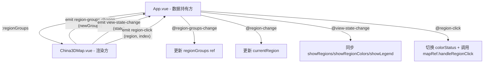

## 用户需求

将 `China3DMap.vue` 中硬编码的 `REGION_GROUPS` 改为通过组件 props 传入，并在此基础上继续优化父子组件通信架构。

## 产品概述

将大区分组配置数据的持有权从子组件移交给父组件，实现单向数据流：父组件通过 props 向下传递数据，子组件通过 emit 事件向上通知状态变更，彻底消除父组件通过 `mapRef.value.xxx` 主动拉取子组件内部状态的反模式。

## 核心功能

- `China3DMap.vue` 新增 `regionGroups` prop 接收大区配置数组，替代内部 `REGION_GROUPS` ref
- `showRegionDistribution` 中修改 `colorStatus` 的逻辑改为 emit `update:regionGroups` 事件
- `handleRegionClick` 的 `colorStatus` 切换逻辑移至父组件，子组件仅 emit `region-click` 事件
- 父组件将 `showRegions/showRegionColors/showLegend` 三个状态从子组件拉取改为通过事件回调同步
- `defineExpose` 精简为仅暴露必要方法：`goBack`、`toggleRegionMode`、`showRegionDistribution`
- 移除 `handleRegionClick` 的 expose，图例点击逻辑完全在父组件内完成
- 移除 `REGION_GROUPS`、`showRegionColors`、`showLegend`、`showRegions` 的 expose
- 父组件所有 `setTimeout` 同步逻辑和 `mapRef.value.xxx` 读取全部删除

## 技术栈

- Vue 3 Composition API（`<script setup>`），无需引入新依赖

## 实现方案

采用 Vue 3 标准单向数据流模式：**Props Down, Events Up**。

### 通信架构重构



### 关键决策

**1. `handleRegionClick` 逻辑拆分**

- 当前子组件同时负责切换 `colorStatus` 和重新渲染地图
- 优化后：子组件仅 emit `region-click(index)` 事件；父组件修改 `regionGroups[index].colorStatus` 后，再调用 `mapRef.value.handleRegionClick(index)` 触发地图重渲染
- 好处：数据修改权归属父组件，子组件 `handleRegionClick` 只保留渲染逻辑，不再操作数据

**2. `showRegionDistribution` 中 colorStatus 更新**

- 当前子组件直接修改 `REGION_GROUPS.value`（通过 map）
- 优化后：子组件计算新的 colorStatus 数组后 emit `update:regionGroups(newGroups)`；父组件更新本地 ref
- 同时 emit `view-state-change` 通知 UI 状态变更

**3. 视图状态同步（showRegions/showRegionColors/showLegend）**

- 当前父组件在 `handleRegionChange`、`goBack`、`toggleRegionMode`、`showRegionDistribution` 四处都通过 `mapRef.value.showRegions` 等主动拉取，其中 `goBack` 还用了 `setTimeout` hack
- 优化后：子组件在状态变化时 emit `view-state-change({ showRegions, showRegionColors, showLegend })`，父组件被动监听更新，删除所有 `mapRef.value.xxx` 读取和 `setTimeout`

**4. emit 事件统一**

- 保留现有 `region-change` 事件（传递 `{ level, name, stack }`）
- 新增 `view-state-change` 事件（传递 `{ showRegions, showRegionColors, showLegend }`）
- 新增 `update:regionGroups` 事件（传递新的 regionGroups 数组）
- 新增 `region-click` 事件（传递 `{ index }`）

### 影响范围分析

**子组件读取 `REGION_GROUPS.value` 的位置**（共 6 处，全部改为 `props.regionGroups`）：

- `getProvinceRegion` (L1283)
- `renderChinaMap` 中的 tooltip formatter (L316) 和 series data (L377)
- `renderRegionGroupMap` 中的 provinceData (L454) 和 tooltip (L490)
- `showRegionDistribution` 中 (L1248, L1261)
- `setupRegionGroupMapEvents` 中 mouseover/mouseout (L580, L604)

**子组件修改 `REGION_GROUPS.value` 的位置**（共 2 处，改为 emit）：

- `handleRegionClick` (L1479)：直接改 `colorStatus`
- `showRegionDistribution` (L1248-1267)：整体 map 重新赋值

**父组件通过 mapRef 读取子组件内部状态的位置**（共 8 处，全部删除）：

- `handleRegionChange`：L77-78, L87, L90
- `goBack`：L100-103
- `toggleRegionMode`：L114-116
- `showRegionDistribution`：L125-128
- `handleRegionClick`：L137

## 实现注意事项

- `regionGroups` prop 设置 `default: () => []`，避免未传值时报错
- `getProvinceRegion` 中遍历 `props.regionGroups` 而非 `REGION_GROUPS.value`
- `defineExpose` 仅保留 `goBack`、`toggleRegionMode`、`showRegionDistribution`、`handleRegionClick`（仅保留渲染逻辑，不操作数据）
- 子组件 `handleRegionClick` 签名改为 `(index)`，只负责根据当前 `props.regionGroups` 重渲染地图
- 父组件 `handleRegionClick` 中先修改本地数据 `regionGroups.value[index].colorStatus = !...`，再调用 `mapRef.value.handleRegionClick(index)` 触发子组件重渲染
- 删除父组件中所有 `setTimeout` hack 同步逻辑

## 目录结构

```
src/
├── App.vue                        # [MODIFY] 定义 INITIAL_REGION_GROUPS 常量；regionGroups ref 持有数据；传入 :regionGroups prop；监听 @view-state-change 同步 UI 状态；监听 @update:regionGroups 更新数据；监听 @region-click 处理图例点击；删除所有 mapRef.value.xxx 读取和 setTimeout
└── components/
    └── China3DMap.vue             # [MODIFY] 删除 REGION_GROUPS ref（L18-119）；新增 regionGroups prop；defineEmits 增加 view-state-change/update:regionGroups/region-click；所有 REGION_GROUPS.value 改为 props.regionGroups；handleRegionClick 改为仅渲染逻辑；showRegionDistribution emit 事件；defineExpose 精简
```